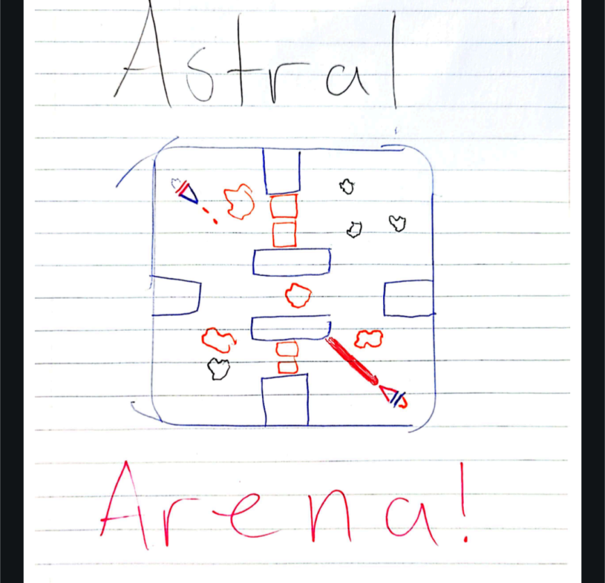

# Astral Arena - CS 151 Final Project!
## Requirements
- **CMake** (>=3.x)
- **C++ Compiler** (C++11 or later)
- **SFML** (for graphics)
- **Build System**: `make`, `MSYS2`, or **Visual Studio** (for Windows)

Welcome to our final project, Astral Arena!
My name is Caleb, and I am working with Justin and Will on this project.
Please enjoy the sketch provided while we work on developing this game.
-----------


Astral Arena is a fast paced battle to the death.  
IN SPACE!  
You are piloting the latest model of our specialized Astral Attack Ships.  
Your goal is to eliminate the enemy while collecting powerups, and destroying obstacles in your way.  
Good luck out there!  

## Building (Linux & Windows)

### 1. Clone the repository:
```bash
git clone https://github.com/Argitechno/astral_arena.git
cd astral_arena
```

### 2. Create the build directory:
```bash
mkdir build
cd build
```

### 3. Configure the project with CMake:
#### For Linux/Windows (MinGW/MSYS2):
```bash
cmake ..
```
#### For Windows (Visual Studio):
```bash
cmake -G "Visual Studio 16 2019" ..
```

### 4. Build the project:
#### On Linux or MinGW/MSYS2:
```bash
make
```
#### On Windows (Visual Studio):
- Open the generated `.sln` file in Visual Studio and build the project.

### 5. Run the project:
```bash
./astral_arena
```

## Cleaning

To clean the build files:
```bash
make clean
```
Or delete the build directory:
```bash
rm -rf build
```

## Notes
- Ensure SFML is installed and properly linked.
- On Windows, use MinGW/MSYS2 or Visual Studio to build.
- Adjust CMakeLists.txt if additional dependencies are needed.
